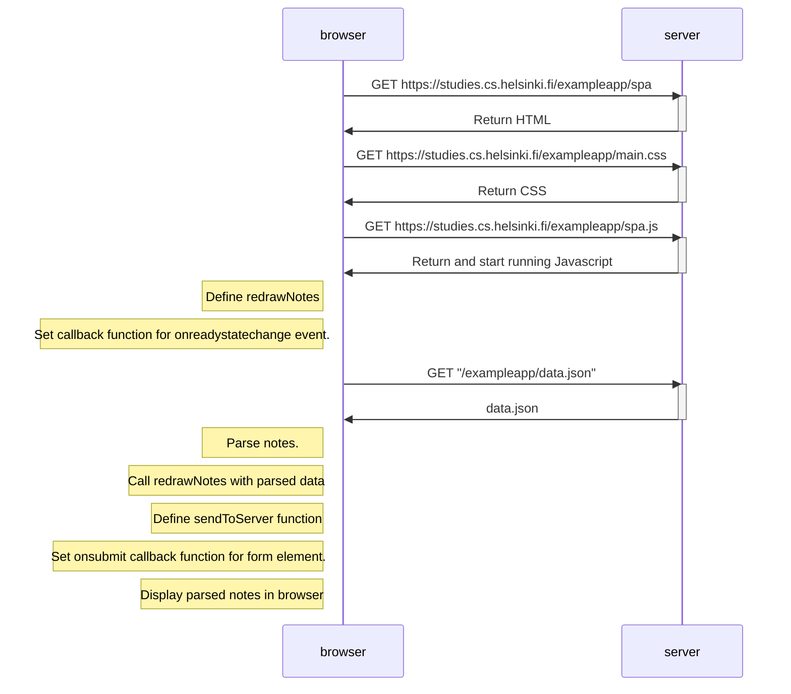

```mermaid
sequenceDiagram
    participant browser
    participant server

    browser ->> server: GET https://studies.cs.helsinki.fi/exampleapp/spa 
    activate server
    server ->> browser: Return HTML
    deactivate server
    browser ->> server: GET https://studies.cs.helsinki.fi/exampleapp/main.css
    activate server
    server ->> browser: Return CSS
    deactivate server
    browser ->> server: GET https://studies.cs.helsinki.fi/exampleapp/spa.js
    activate server
    server ->> browser: Return and start running Javascript
    deactivate server

    Note left of browser: Define redrawNotes

    Note left of browser: Set callback function for onreadystatechange event.
    
    browser ->> server: GET "/exampleapp/data.json"
    
    activate server

    
    server ->> browser: data.json
    deactivate server
    Note left of browser: Parse notes.
    

    Note left of browser: Call redrawNotes with parsed data
    
    Note left of browser: Define sendToServer function

    Note left of browser: Set onsubmit callback function for form element.
    
    Note left of browser: Display parsed notes in browser
```