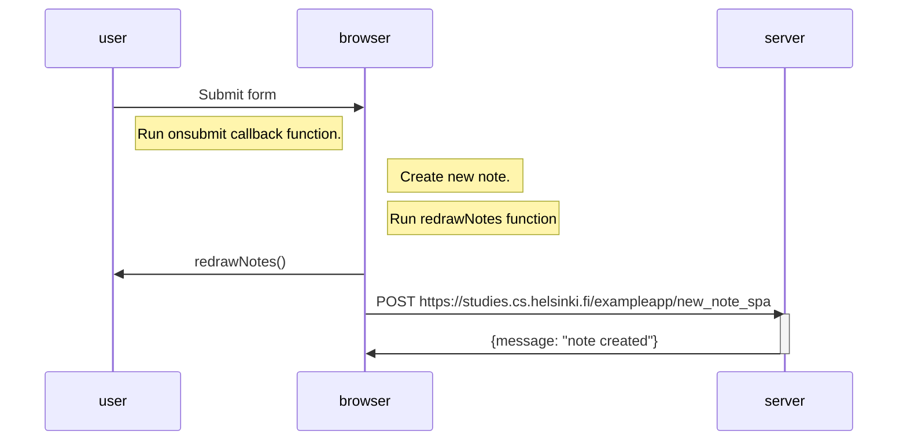

```mermaid
sequenceDiagram
    participant user
    participant browser
    participant server


    user ->> browser: Submit form
    
    Note left of browser: Run onsubmit callback function.

    Note right of browser: Create new note.

    Note right of browser: Run redrawNotes function

    browser ->> user: redrawNotes()

    browser ->> server: POST https://studies.cs.helsinki.fi/exampleapp/new_note_spa

    activate server

    server ->> browser: {message: "note created"}

    deactivate server
```